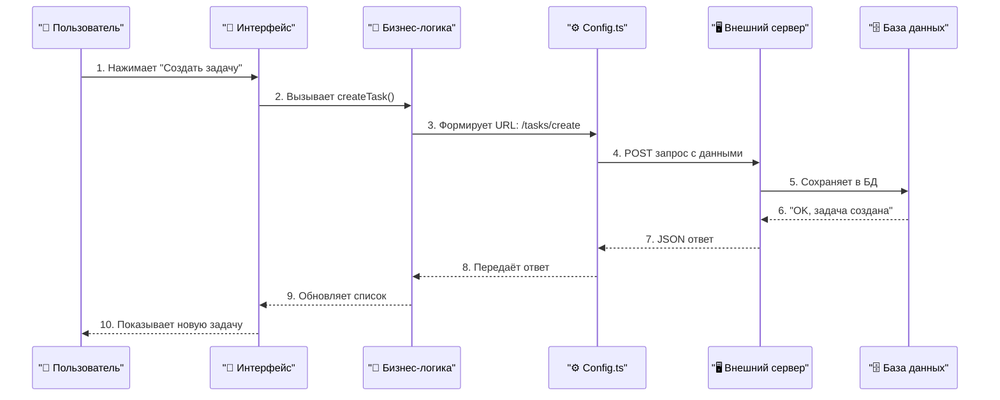
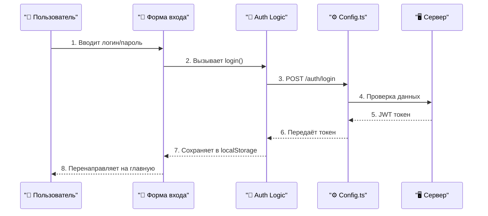
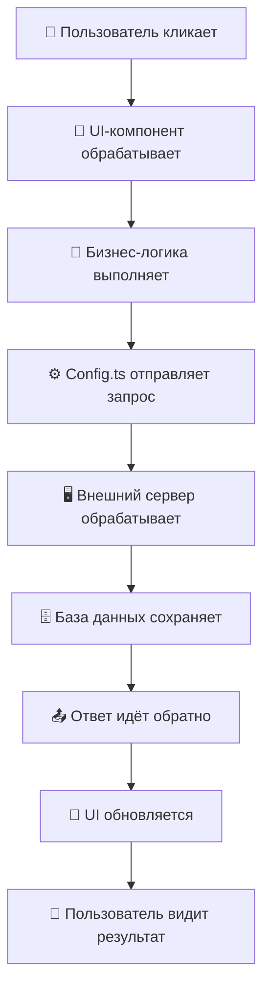
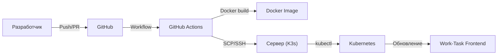

# Work-Task Frontend

## 🔄 Обновление системы ролей и оптимизация (25.07.2025)

### Ролевая модель
- ✨ Реализована полная ролевая модель с разграничением доступа
- 🔒 Добавлена изоляция административных функций
- 🚀 Оптимизированы API запросы с учетом ролей

### Оптимизация производительности
- 🛑 Блокировка ненужных API запросов для администраторов
- 🔄 Предотвращение лишних запросов при обновлении страницы
- ⚡ Улучшена производительность за счет условного рендеринга

### Изменения в интерфейсе
- 📊 Обновлен дашборд с учетом ролей пользователей
- 👑 Добавлена административная панель
- 🎯 Скрыты недоступные функции для разных ролей

## 📚 Документация проекта

### Основные разделы
- [Аутентификация и роли](src/features/auth/README.md)
  - [API аутентификации](src/features/auth/api/README.md)
  - [Компоненты аутентификации](src/features/auth/components/README.md)
  - [Хуки аутентификации](src/features/auth/hooks/README.md)

- [Проекты](src/features/projects/README.md)
  - [API проектов](src/features/projects/api/README.md)
  - [Компоненты проектов](src/features/projects/components/README.md)
  - [Хуки проектов](src/features/projects/hooks/README.md)

- [Задачи](src/features/tasks/README.md)
  - [API задач](src/features/tasks/api/README.md)
  - [Компоненты задач](src/features/tasks/components/README.md)
  - [Хуки задач](src/features/tasks/hooks/README.md)

### Компоненты и утилиты
- [UI компоненты](src/components/README.md)
  - [Отображение данных](src/components/data-display/README.md)
  - [Обратная связь](src/components/feedback/README.md)
  - [Элементы ввода](src/components/inputs/README.md)
  - [Компоненты лейаута](src/components/layout/README.md)
  - [Навигация](src/components/navigation/README.md)
  - [UI контролы](src/components/ui/README.md)

### Страницы приложения
- [Дашборд](src/app/(dashboard)/README.md)
  - [Админ панель](src/app/(dashboard)/admin/README.md)
  - [Проекты](src/app/(dashboard)/projects/README.md)
  - [Настройки проекта](src/app/(dashboard)/projects/[projectId]/settings/README.md)
  - [Задачи](src/app/(dashboard)/tasks/README.md)

### Утилиты и библиотеки
- [Библиотеки и утилиты](src/lib/README.md)
- [Хуки](src/hooks/README.md)

---

## 🚀 Быстрый старт

1. **Требования:**
   - **Node.js** >= 20.17.0 — это среда, в которой запускается JavaScript вне браузера. Необходима для работы всех современных фронтенд-проектов
   - **npm** >= 10.8.2 — менеджер пакетов для установки зависимостей
   - **Рекомендуется [nvm](https://github.com/nvm-sh/nvm)** — это инструмент для удобного переключения между разными версиями Node.js
   - **Проверить версии:**
     ```bash
     node -v
     npm -v
     ```
   - **Если версия ниже:**
     - **Обновить через сайт:**
       1. Перейдите на [nodejs.org](https://nodejs.org/)
       2. Скачайте и установите последнюю LTS-версию для вашей ОС
       3. Перезапустите терминал и проверьте версии снова
     - **Обновить через nvm (если установлен):**
       ```bash
       nvm install 20
       nvm use 20
       nvm alias default 20
       node -v
       npm -v
       ```
   - **Зачем это нужно:** Современные проекты используют новые возможности языка и инструментов, которые не поддерживаются старыми версиями Node.js и npm. Если не обновить — проект может не запуститься или работать с ошибками.

---

## 🧬 Автоматическая генерация типов из OpenAPI

В проекте все типы данных для API (DTO) **автоматически генерируются** из OpenAPI-спецификации бэкенда. Это гарантирует актуальность типов и избавляет от ручного дублирования.

**Где лежат типы:**  
`src/lib/types.api.ts` — автогенерируемый файл, не редактируйте его вручную!

**Как обновить типы при изменении API:**

1. Убедитесь, что установлен пакет [`swagger-typescript-api`](https://github.com/acacode/swagger-typescript-api) (уже есть в devDependencies).
2. Выполните команду:
   ```bash
   npm run openapi
   ```
   или вручную:
   ```bash
   npx swagger-typescript-api -p http://91.211.249.37/test/v3/api-docs -o src/lib -n types.api.ts
   ```
   - `-p` — путь к OpenAPI/Swagger JSON
   - `-o` — куда положить сгенерированные типы
   - `-n` — имя файла
3. После генерации используйте типы из `@/lib/types.api` во всех API-хуках и сервисах.

> **Важно:**
> - Не редактируйте `types.api.ts` вручную — все изменения будут перезаписаны при следующей генерации.
> - Если структура API изменилась, всегда обновляйте типы перед началом работы.

---

## 📝 Сводка о проекте

- **Что это:** Приложение для управления задачами и проектами (таск-трекер)
- **Технологии:** Next.js 14, TypeScript, React, Tailwind CSS, React Query, Radix UI
- **Где работает:** Любой современный браузер, Node.js >= 20.17.0
- **Интеграции:**
  - Внешний REST API (бэкенд на отдельном сервере)
  - CI/CD через GitHub Actions
  - Docker/Kubernetes (K3s)
- **Структура:**
  - UI-компоненты (`src/components/`)
  - Бизнес-логика (`src/features/`)
  - Конфигурация API (`src/config.ts`)
  - Конфиги, хуки, утилиты и т.д.

---

## 🏗️ Как работает Work-Task: пошаговый разбор

### 1. Конкретный пример: пользователь создаёт новую задачу

**Что видит пользователь:**
1. Открывает страницу "Задачи"
2. Нажимает кнопку "Создать задачу" 
3. Заполняет форму: название, описание, срок
4. Нажимает "Сохранить"
5. Видит новую задачу в списке

**Что происходит в коде (пошагово):**



**Где в проекте это происходит:**

| Шаг | Что происходит | Файл в проекте | Код |
|-----|----------------|----------------|-----|
| 1-2 | Пользователь нажимает кнопку | `src/components/` | `onClick={handleCreate}` |
| 3 | Формируется запрос | `src/features/tasks/` | `useCreateTask()` |
| 4 | Отправляется на сервер | `src/config.ts` | `buildApiUrl('/tasks/create')` |
| 5-6 | Сервер сохраняет данные | Внешний сервер | `INSERT INTO tasks...` |
| 7-10 | Ответ возвращается обратно | Все те же файлы | Обновление UI |

---

### 2. Ещё пример: пользователь входит в систему

**Что видит пользователь:**
1. Открывает страницу входа
2. Вводит email и пароль
3. Нажимает "Войти"
4. Попадает на главную страницу

**Что происходит в коде:**



---

### 3. Архитектура проекта: что где лежит

**🎨 UI-компоненты (`src/components/`):**
- Кнопки, формы, списки
- Всё, что пользователь видит и с чем взаимодействует
- **Пример:** `Button.tsx`, `TaskForm.tsx`, `TaskList.tsx`

**🧠 Бизнес-логика (`src/features/`):**
- Обработка действий пользователя
- Правила работы приложения
- **Пример:** `useCreateTask.ts`, `useLogin.ts`

**⚙️ Конфигурация (`src/config.ts`):**
- Настройки API
- URL сервера, эндпоинты
- **Пример:** `buildApiUrl('/tasks/create')`

**🖥️ Внешний сервер:**
- Обработка запросов
- База данных
- Безопасность

---

### 4. Почему так устроено?

**✅ Преимущества:**
- **Чёткое разделение:** UI отдельно от логики, логика отдельно от API
- **Легко тестировать:** каждую часть можно проверить отдельно
- **Просто поддерживать:** если сломалась кнопка — идём в компоненты, если логика — в features
- **Масштабируемо:** легко добавлять новые функции

**🔧 Как это помогает разработчику:**
- Нужно изменить дизайн кнопки → `src/components/`
- Нужно добавить валидацию формы → `src/features/`
- Нужно поменять URL API → `src/config.ts`
- Нужно изменить логику на сервере → внешний репозиторий

---

### 5. Полная картина: от клика до результата



---

## 🧩 Как данные путешествуют по приложению

> Что происходит, когда ты работаешь с задачами в Work-Task

### Конкретный пример: создание задачи

**Шаг 1: Ты открываешь страницу "Задачи"**
- Что происходит: загружается список задач
- Где в коде: `src/app/(dashboard)/tasks/page.tsx`
- Что видишь: список задач, кнопка "Создать задачу"

**Шаг 2: Ты нажимаешь "Создать задачу"**
- Что происходит: открывается модальное окно с формой
- Где в коде: `src/features/tasks/components/create-task-modal.tsx`
- Что видишь: форму для ввода названия, описания, срока

**Шаг 3: Ты заполняешь форму и нажимаешь "Сохранить"**
- Что происходит: данные передаются в обработчик
- Где в коде: `src/features/tasks/components/create-task-form.tsx`
- Что происходит: валидация данных, подготовка к отправке

**Шаг 4: Данные отправляются на сервер**
- Что происходит: формируется HTTP запрос
- Где в коде: `src/features/tasks/api/use-create-task.ts`
- Что отправляется: название, описание, срок, проект

**Шаг 5: Сервер обрабатывает запрос**
- Что происходит: данные сохраняются в базе данных
- Где в коде: внешний сервер (не в этом проекте)
- Что возвращается: ID новой задачи, статус "создана"

**Шаг 6: Ответ приходит обратно**
- Что происходит: обновляется список задач
- Где в коде: `src/features/tasks/api/use-get-tasks.ts`
- Что видишь: новая задача появляется в списке

**Шаг 7: Интерфейс обновляется**
- Что происходит: модальное окно закрывается, список обновляется
- Где в коде: `src/components/data-display/tasks.tsx`
- Что видишь: новая задача в списке с правильным статусом

### Ещё пример: вход в систему

**Шаг 1: Ты открываешь страницу входа**
- Что происходит: загружается форма входа
- Где в коде: `src/app/(auth)/sign-in/page.tsx`

**Шаг 2: Ты вводишь email и пароль**
- Что происходит: данные сохраняются в форме
- Где в коде: `src/features/auth/components/sign-in-card.tsx`

**Шаг 3: Ты нажимаешь "Войти"**
- Что происходит: данные отправляются на сервер
- Где в коде: `src/features/auth/api/use-login.ts`

**Шаг 4: Сервер проверяет данные**
- Что происходит: проверка email/пароля в базе
- Где в коде: внешний сервер

**Шаг 5: Сервер возвращает токен**
- Что происходит: JWT токен сохраняется в браузере
- Где в коде: `src/features/auth/api/use-current.ts`

**Шаг 6: Ты попадаешь на главную страницу**
- Что происходит: перенаправление на dashboard
- Где в коде: `src/app/(dashboard)/page.tsx`

### Структура файлов по шагам:

```
👤 Пользователь → 📄 Страница → 🎨 Компонент → 🧠 API → 🌐 Сервер
```

**Каждый шаг — это конкретный файл в проекте:**
- Страницы: `src/app/(dashboard)/tasks/page.tsx`
- Компоненты: `src/features/tasks/components/`
- API: `src/features/tasks/api/`
- Конфигурация: `src/config.ts`

### Если что-то не работает:

- **Форма не открывается** → проверь `src/features/tasks/components/create-task-modal.tsx`
- **Данные не отправляются** → проверь `src/features/tasks/api/use-create-task.ts`
- **Список не обновляется** → проверь `src/features/tasks/api/use-get-tasks.ts`
- **Ошибка подключения** → проверь `src/config.ts`

---

## ⚙️ CI/CD Pipeline (Деплой)

> Как код из репозитория автоматически попадает на сервер и разворачивается.



**Пояснение:**
Показывает, как происходит автоматический деплой: от коммита до обновления приложения на сервере.

---

## 🗂️ Архитектура основных папок проекта

- `src/components/` — UI-компоненты: кнопки, формы, списки, модальные окна и всё, что отвечает за внешний вид и взаимодействие с пользователем.
- `src/features/` — бизнес-логика: обработка действий пользователя, правила работы приложения, интеграция с API.
- `src/config.ts` — конфигурация API: настройки для подключения к внешнему серверу, эндпоинты и утилиты для работы с API.
- `src/hooks/` — кастомные хуки React: переиспользуемые функции для работы с состоянием, эффектами и т.д.
- `src/lib/` — утилиты, вспомогательные функции и типы.
- `public/` — статические файлы: картинки, иконки, шрифты.
- `config.ts`, `package.json`, конфиги — настройки, зависимости, скрипты.

> Эти папки — основа архитектуры. Внутри них могут появляться новые файлы и подпапки, но сами разделы почти не меняются.

---

## 🧩 Технологии 

- [Next.js 14](https://nextjs.org/) — современный фреймворк для сайтов
- [TypeScript](https://www.typescriptlang.org/) — помогает не ошибаться в коде
- [React Query](https://tanstack.com/query/latest) — ускоряет работу с сервером
- [Tailwind CSS](https://tailwindcss.com/docs) — красивые стили прямо в коде
- [Radix UI](https://www.radix-ui.com/docs/primitives/overview/introduction) — готовые элементы интерфейса

---

## 💡 Советы

- Читать README.md в каждой папке — там всё объяснено.
- Если что-то не работает — внимательно читайте ошибку в терминале.
- Перед коммитом всегда запускайте `npm run lint`.
- Любое изменение — это вклад в проект!

---

## ❓ FAQ (Частые вопросы и проблемы)

**Q: У меня ошибка про несовместимость Node.js или npm**  
A: Проверьте версии через `node -v` и `npm -v`. Если ниже требуемых — обновите Node.js (см. раздел "Требования").

**Q: Ошибка EADDRINUSE: порт 3000 уже используется**  
A: Закройте другое приложение, использующее этот порт, или запустите проект на другом порту: `PORT=3001 npm run dev`

**Q: Ошибка при установке зависимостей (npm install)**  
A: Попробуйте удалить папку `node_modules` и файл `package-lock.json`, затем снова выполнить `npm install`.

**Q: Ошибка 'Cannot find module ...' или 'Module not found'**  
A: Проверьте, что все зависимости установлены (`npm install`). Если не помогло — удалите `node_modules` и `package-lock.json`, затем снова установите.

**Q: Ошибка 'npm: command not found'**  
A: Убедитесь, что Node.js и npm установлены и доступны в PATH. Проверьте через `node -v` и `npm -v`.

**Q: Как обновить npm до последней версии?**  
A: Выполните `npm install -g npm@latest` (может потребоваться sudo на Linux/Mac).

**Q: Как очистить кэш npm?**  
A: Выполните `npm cache clean --force`.

**Q: Как узнать, какие зависимости устарели?**  
A: Выполните `npm outdated`.

**Q: Как проверить проект на уязвимости?**  
A: Выполните `npm audit`.

**Q: Как запустить тесты?**  
A: Если тесты настроены — используйте `npm run test`.

**Q: Где искать документацию по отдельным модулям?**  
A: В каждой основной папке есть свой README.md с деталями и примерами.

**Q: Как внести свой вклад?**  
A: Создайте ветку, внесите изменения, отправьте Pull Request.

---

**Автор:** @krutakov
