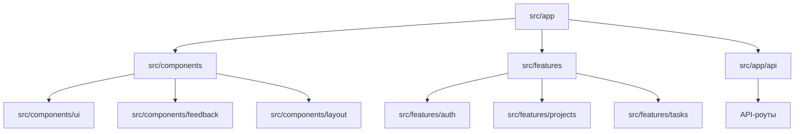
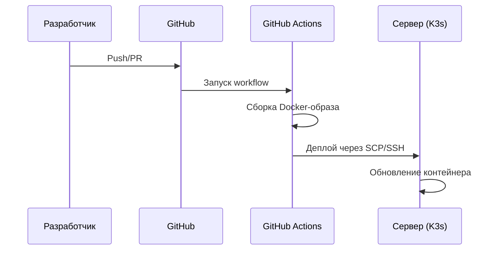

# 🚀 Work-Task Frontend

> **Добро пожаловать!**
> Это современное приложение для управления задачами и проектами. Даже если вы никогда не писали код — вы сможете разобраться и внести свой вклад!

---

## 🏁 Что такое Work-Task?
Work-Task — это сайт, где можно создавать проекты, задачи, отмечать их выполнение и работать в команде. Проект написан на современном стеке: **Next.js 14**, **TypeScript**, **React**, **Tailwind CSS**.

---

## 📚 Как начать? (Пошаговое обучение)

1. **Установите Node.js** (версия >= 20.17.0) и npm (>= 10.8.2). Лучше всего через [nvm](https://github.com/nvm-sh/nvm).
2. Скачайте проект:
   ```bash
   git clone <ссылка на репозиторий>
   cd frontend
   ```
3. Установите зависимости:
   ```bash
   npm install
   ```
4. Запустите проект в режиме разработки:
   ```bash
   npm run dev
   ```
5. Откройте [http://localhost:3000](http://localhost:3000) в браузере.
6. Для продакшена:
   ```bash
   npm run build
   npm start
   ```

---

## 🗺️ Архитектура приложения

> Как связаны основные части фронтенда, API и сервер:

```mermaid
flowchart TD
  User[Пользователь в браузере]
  UI[UI-компоненты (src/components)]
  Pages[Страницы (src/app)]
  Features[Бизнес-логика (src/features)]
  API[API-запросы (src/app/api)]
  Server[Сервер/Бэкенд]
  DB[База данных]

  User -->|HTTP| Pages
  Pages --> UI
  Pages --> Features
  Features -->|fetch/axios| API
  API -->|REST| Server
  Server --> DB
```

---

## 🔄 Жизненный цикл задачи (Task)

> Как проходит задача от создания до удаления:

```mermaid
flowchart LR
  A[Создание задачи] --> B[Отображение в списке/канбане]
  B --> C[Редактирование задачи]
  C --> D[Изменение статуса (выполнено/в процессе)]
  D --> E[Удаление задачи]
  B --> D
```

---

## 🗂️ Связи директорий и модулей

> Как основные директории взаимодействуют друг с другом:



---

## ⚙️ CI/CD: Автоматический деплой

> Как происходит автоматическая сборка и деплой через GitHub Actions:



---

## 🗂️ Полная структура проекта (с путями до каждого файла)

```
frontend/
├── .github/
│   └── workflows/
│       └── deploy.yml
├── public/
│   └── logo.svg
├── src/
│   ├── app/
│   │   ├── (auth)/
│   │   │   ├── sign-in/
│   │   │   │   ├── page.tsx
│   │   │   │   └── README.md
│   │   │   ├── sign-up/
│   │   │   │   ├── page.tsx
│   │   │   │   └── README.md
│   │   │   ├── layout.tsx
│   │   │   └── README.md
│   │   ├── (dashboard)/
│   │   │   ├── tasks/
│   │   │   │   ├── page.tsx
│   │   │   │   └── README.md
│   │   │   ├── projects/
│   │   │   │   ├── [projectId]/
│   │   │   │   │   ├── page.tsx
│   │   │   │   │   └── README.md
│   │   │   │   ├── page.tsx
│   │   │   │   └── README.md
│   │   │   ├── settings/
│   │   │   │   ├── page.tsx
│   │   │   │   └── README.md
│   │   │   ├── page.tsx
│   │   │   ├── layout.tsx
│   │   │   └── README.md
│   │   ├── (standalone)/
│   │   │   ├── layout.tsx
│   │   │   └── README.md
│   │   ├── api/
│   │   │   ├── [[...route]]/
│   │   │   │   ├── route.ts
│   │   │   │   └── README.md
│   │   │   ├── route.ts
│   │   │   └── README.md
│   │   ├── oauth/
│   │   │   ├── route.ts
│   │   │   └── README.md
│   │   ├── fonts/
│   │   │   ├── GeistVF.woff
│   │   │   ├── GeistMonoVF.woff
│   │   │   └── README.md
│   │   ├── globals.css
│   │   ├── layout.tsx
│   │   ├── loading.tsx
│   │   ├── favicon.ico
│   │   ├── error.tsx
│   │   └── README.md
│   ├── components/
│   │   ├── ui/
│   │   │   ├── controls/
│   │   │   │   ├── avatar.tsx
│   │   │   │   ├── button.tsx
│   │   │   │   ├── calendar.tsx
│   │   │   │   ├── checkbox.tsx
│   │   │   │   └── README.md
│   │   │   ├── feedback/
│   │   │   │   ├── badge.tsx
│   │   │   │   ├── skeleton.tsx
│   │   │   │   ├── sonner.tsx
│   │   │   │   ├── visually-hidden.tsx
│   │   │   │   └── README.md
│   │   │   ├── form/
│   │   │   │   ├── form.tsx
│   │   │   │   ├── input.tsx
│   │   │   │   ├── label.tsx
│   │   │   │   ├── select.tsx
│   │   │   │   ├── textarea.tsx
│   │   │   │   └── README.md
│   │   │   ├── layout/
│   │   │   │   ├── card.tsx
│   │   │   │   ├── chart.tsx
│   │   │   │   ├── dialog.tsx
│   │   │   │   ├── drawer.tsx
│   │   │   │   ├── dropdown-menu.tsx
│   │   │   │   ├── popover.tsx
│   │   │   │   ├── scroll-area.tsx
│   │   │   │   ├── separator.tsx
│   │   │   │   ├── sheet.tsx
│   │   │   │   ├── table.tsx
│   │   │   │   ├── tabs.tsx
│   │   │   │   └── README.md
│   │   │   └── README.md
│   │   ├── navigation/
│   │   │   ├── navigation.tsx
│   │   │   ├── workspace-switcher.tsx
│   │   │   └── README.md
│   │   ├── layout/
│   │   │   ├── mobile-sidebar.tsx
│   │   │   ├── navbar.tsx
│   │   │   ├── query-provider.tsx
│   │   │   ├── sidebar.tsx
│   │   │   └── README.md
│   │   ├── feedback/
│   │   │   ├── dotted-separator.tsx
│   │   │   ├── page-error.tsx
│   │   │   ├── page-loader.tsx
│   │   │   ├── responsive-modal.tsx
│   │   │   └── README.md
│   │   ├── inputs/
│   │   │   ├── date-picker.tsx
│   │   │   └── README.md
│   │   ├── data-display/
│   │   │   ├── analytics-card.tsx
│   │   │   ├── analytics.tsx
│   │   │   ├── projects.tsx
│   │   │   └── README.md
│   │   └── README.md
│   ├── features/
│   │   ├── auth/
│   │   │   ├── api/
│   │   │   │   ├── use-current.ts
│   │   │   │   ├── use-login.ts
│   │   │   │   ├── use-logout.ts
│   │   │   │   ├── use-register.ts
│   │   │   │   └── README.md
│   │   │   ├── components/
│   │   │   │   ├── sign-in-card.tsx
│   │   │   │   ├── sign-up-card.tsx
│   │   │   │   ├── user-button.tsx
│   │   │   │   └── README.md
│   │   │   ├── constants.ts
│   │   │   ├── queries.ts
│   │   │   ├── schemas.ts
│   │   │   └── README.md
│   │   ├── projects/
│   │   │   ├── api/
│   │   │   │   ├── use-create-project.ts
│   │   │   │   ├── use-get-project.ts
│   │   │   │   ├── use-get-projects.ts
│   │   │   │   └── README.md
│   │   │   ├── components/
│   │   │   │   ├── create-project-form.tsx
│   │   │   │   ├── create-project-modal.tsx
│   │   │   │   ├── edit-project-form.tsx.disabled
│   │   │   │   ├── project-avatar.tsx
│   │   │   │   └── README.md
│   │   │   ├── hooks/
│   │   │   │   ├── use-create-project-modal.ts
│   │   │   │   ├── use-project-id.ts
│   │   │   │   └── README.md
│   │   │   ├── schemas.ts
│   │   │   ├── types.ts
│   │   │   └── README.md
│   │   ├── tasks/
│   │   │   ├── api/
│   │   │   │   ├── use-create-task.ts
│   │   │   │   ├── use-get-tasks.ts
│   │   │   │   ├── use-update-task.ts
│   │   │   │   └── README.md
│   │   │   ├── components/
│   │   │   │   ├── calendar/
│   │   │   │   ├── filters/
│   │   │   │   ├── forms/
│   │   │   │   ├── kanban/
│   │   │   │   ├── table/
│   │   │   │   ├── create-task-form-wrapper.tsx
│   │   │   │   ├── create-task-form.tsx
│   │   │   │   ├── create-task-modal.tsx
│   │   │   │   └── README.md
│   │   │   ├── hooks/
│   │   │   │   ├── use-create-task-modal.ts
│   │   │   │   ├── use-edit-task-modal.ts
│   │   │   │   ├── use-task-filters.ts
│   │   │   │   ├── use-task-id.ts
│   │   │   │   └── README.md
│   │   │   ├── schemas.ts
│   │   │   ├── types.ts
│   │   │   └── README.md
│   ├── lib/
│   │   ├── rpc.ts
│   │   ├── utils.ts
│   │   ├── types.ts
│   │   └── README.md
│   ├── hooks/
│   │   ├── use-confirm.tsx
│   │   └── README.md
│   ├── config.ts
├── tailwind.config.ts
├── next.config.mjs
├── postcss.config.mjs
├── package.json
├── package-lock.json
├── Dockerfile
├── nginx.conf
├── components.json
├── README.md
└── tsconfig.json
```

> В каждой папке есть свой README.md с примерами и объяснениями.

---

## 🛠️ Основные команды

- `npm run dev` — запуск в режиме разработки
- `npm run build` — сборка для продакшена
- `npm start` — запуск production-сервера
- `npm run lint` — проверка кода на стиль

---

## 🧩 Технологии (не бойтесь, всё просто!)

- [Next.js 14](https://nextjs.org/) — современный фреймворк для сайтов
- [TypeScript](https://www.typescriptlang.org/) — помогает не ошибаться в коде
- [React Query](https://tanstack.com/query/latest) — ускоряет работу с сервером
- [Tailwind CSS](https://tailwindcss.com/docs) — красивые стили прямо в коде
- [Radix UI](https://www.radix-ui.com/docs/primitives/overview/introduction) — готовые элементы интерфейса

---

## 💡 Советы новичкам

- Не стесняйтесь читать README.md в каждой папке — там всё объяснено!
- Если что-то не работает — внимательно читайте ошибку в терминале.
- Не бойтесь спрашивать или искать ответы в Google.
- Перед коммитом всегда запускайте `npm run lint`.
- Любое изменение — это вклад в проект!

---

## ❓ FAQ (Частые вопросы)

**Q: У меня ошибка про Node.js или npm?**  
A: Проверьте версии через `node -v` и `npm -v`. Используйте Node.js >= 20.17.0 и npm >= 10.8.2.

**Q: Как запустить проект?**  
A: Просто выполните шаги из раздела "Как начать" выше.

**Q: Где искать документацию по отдельным модулям?**  
A: В каждой папке есть свой README.md с примерами.

**Q: Как внести свой вклад?**  
A: Создайте ветку, внесите изменения, отправьте Pull Request.

---

**Автор:** @krutakov
