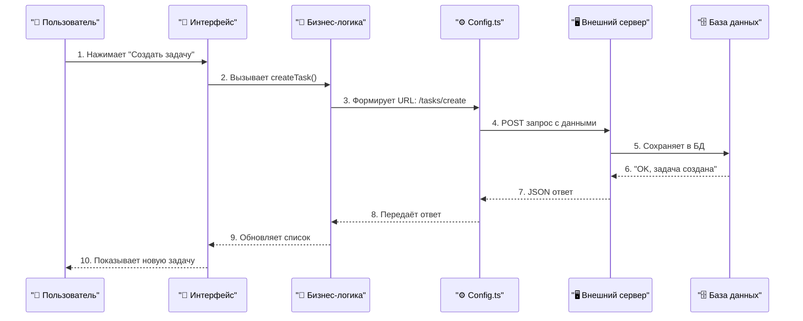
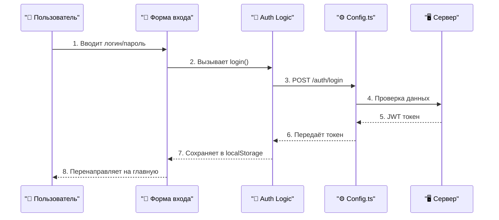
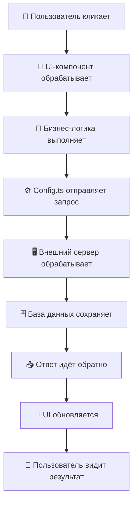
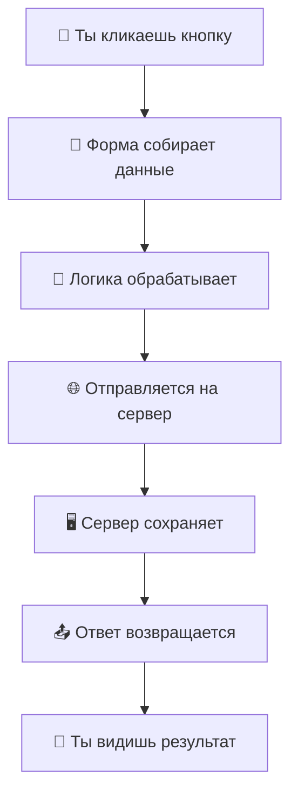
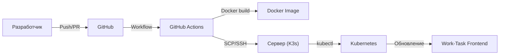

#  Work-Task Frontend

---

##  Быстрый старт

1. **Требования:**
   - **Node.js** >= 20.17.0 — это среда, в которой запускается JavaScript вне браузера. Необходима для работы всех современных фронтенд-проектов
   - **npm** >= 10.8.2 — менеджер пакетов для установки зависимостей
   - **Рекомендуется [nvm](https://github.com/nvm-sh/nvm)** — это инструмент для удобного переключения между разными версиями Node.js
   - **Проверить версии:**
     ```bash
     node -v
     npm -v
     ```
   - **Если версия ниже:**
     - **Обновить через сайт:**
       1. Перейдите на [nodejs.org](https://nodejs.org/)
       2. Скачайте и установите последнюю LTS-версию для вашей ОС
       3. Перезапустите терминал и проверьте версии снова
     - **Обновить через nvm (если установлен):**
       ```bash
       nvm install 20
       nvm use 20
       nvm alias default 20
       node -v
       npm -v
       ```
   - **Зачем это нужно:** Современные проекты используют новые возможности языка и инструментов, которые не поддерживаются старыми версиями Node.js и npm. Если не обновить — проект может не запуститься или работать с ошибками.

2. **Установка и запуск:**
   - **Склонируйте репозиторий:** скачайте проект к себе на компьютер.
     ```bash
     git clone <ссылка на репозиторий>
     ```
   - **Установите зависимости:** скачайте все нужные библиотеки для работы проекта.
     ```bash
     npm install
     ```
   - **Запустите проект в режиме разработки:**
     ```bash
     npm run dev
     ```
     После запуска откройте [http://localhost:3000](http://localhost:3000) в браузере.
     - Если порт 3000 занят, либо закройте другое приложение, либо используйте переменную окружения: `PORT=3001 npm run dev`
   - **Сборка и запуск для продакшена:**
     ```bash
     npm run build
     npm start
     ```
     Это создаст оптимизированную версию приложения и запустит её как production-сервер.
   - **Если что-то не работает:**
     - Проверьте сообщения об ошибках в терминале — они обычно подсказывают, что делать.
     - Убедитесь, что установлены правильные версии Node.js и npm.
     - Попробуйте удалить папку `node_modules` и файл `package-lock.json`, затем снова выполнить `npm install`.

---

## 🛠️ Полезные команды для фронта

- `npm run dev` — запуск проекта в режиме разработки (автоматически обновляет страницу при изменениях кода)
- `npm run build` — сборка проекта для продакшена (создаёт оптимизированную версию)
- `npm start` — запуск production-сервера (используется после сборки)
- `npm run lint` — проверка кода на стиль и ошибки (ESLint)
- `npm run format` — автоформатирование кода (например, Prettier; может не быть настроено)
- `npm run analyze` — анализ размера бандла (если настроено; помогает понять, что занимает место в сборке)
- `npm run test` — запуск тестов (если есть; для проверки работоспособности кода)
- `npm outdated` — показать устаревшие зависимости (помогает поддерживать проект в актуальном состоянии)
- `npm audit` — аудит безопасности зависимостей (ищет уязвимости)
- `npm ls` — показать дерево зависимостей (для диагностики проблем с пакетами)

> Некоторые команды могут быть не настроены по умолчанию — смотрите `package.json` для полного списка и описания.

---

## 📝 Сводка о проекте

- **Что это:** Приложение для управления задачами и проектами (таск-трекер)
- **Технологии:** Next.js 14, TypeScript, React, Tailwind CSS, React Query, Radix UI
- **Где работает:** Любой современный браузер, Node.js >= 20.17.0
- **Интеграции:**
  - Внешний REST API (бэкенд на отдельном сервере)
  - CI/CD через GitHub Actions
  - Docker/Kubernetes (K3s)
- **Структура:**
  - UI-компоненты (`src/components/`)
  - Бизнес-логика (`src/features/`)
  - Конфигурация API (`src/config.ts`)
  - Конфиги, хуки, утилиты и т.д.

---

## 🏗️ Как работает Work-Task: пошаговый разбор

### 1. Конкретный пример: пользователь создаёт новую задачу

**Что видит пользователь:**
1. Открывает страницу "Задачи"
2. Нажимает кнопку "Создать задачу" 
3. Заполняет форму: название, описание, срок
4. Нажимает "Сохранить"
5. Видит новую задачу в списке

**Что происходит в коде (пошагово):**



**Где в проекте это происходит:**

| Шаг | Что происходит | Файл в проекте | Код |
|-----|----------------|----------------|-----|
| 1-2 | Пользователь нажимает кнопку | `src/components/` | `onClick={handleCreate}` |
| 3 | Формируется запрос | `src/features/tasks/` | `useCreateTask()` |
| 4 | Отправляется на сервер | `src/config.ts` | `buildApiUrl('/tasks/create')` |
| 5-6 | Сервер сохраняет данные | Внешний сервер | `INSERT INTO tasks...` |
| 7-10 | Ответ возвращается обратно | Все те же файлы | Обновление UI |

---

### 2. Ещё пример: пользователь входит в систему

**Что видит пользователь:**
1. Открывает страницу входа
2. Вводит email и пароль
3. Нажимает "Войти"
4. Попадает на главную страницу

**Что происходит в коде:**



---

### 3. Архитектура проекта: что где лежит

**🎨 UI-компоненты (`src/components/`):**
- Кнопки, формы, списки
- Всё, что пользователь видит и с чем взаимодействует
- **Пример:** `Button.tsx`, `TaskForm.tsx`, `TaskList.tsx`

**🧠 Бизнес-логика (`src/features/`):**
- Обработка действий пользователя
- Правила работы приложения
- **Пример:** `useCreateTask.ts`, `useLogin.ts`

**⚙️ Конфигурация (`src/config.ts`):**
- Настройки API
- URL сервера, эндпоинты
- **Пример:** `buildApiUrl('/tasks/create')`

**🖥️ Внешний сервер:**
- Обработка запросов
- База данных
- Безопасность

---

### 4. Почему так устроено?

**✅ Преимущества:**
- **Чёткое разделение:** UI отдельно от логики, логика отдельно от API
- **Легко тестировать:** каждую часть можно проверить отдельно
- **Просто поддерживать:** если сломалась кнопка — идём в компоненты, если логика — в features
- **Масштабируемо:** легко добавлять новые функции

**🔧 Как это помогает разработчику:**
- Нужно изменить дизайн кнопки → `src/components/`
- Нужно добавить валидацию формы → `src/features/`
- Нужно поменять URL API → `src/config.ts`
- Нужно изменить логику на сервере → внешний репозиторий

---

### 5. Полная картина: от клика до результата



---

## 🧩 Как данные путешествуют по приложению

> Простыми словами: что происходит, когда ты что-то делаешь в приложении

### Представь, что ты заказываешь пиццу:

1. **Ты звонишь в пиццерию** (кликаешь кнопку)
2. **Оператор записывает заказ** (форма собирает данные)
3. **Оператор передаёт заказ повару** (данные идут в логику)
4. **Повар готовит пиццу** (сервер обрабатывает запрос)
5. **Пицца готова** (ответ возвращается)
6. **Тебе приносят пиццу** (ты видишь результат)

### В нашем приложении то же самое:



### Конкретный пример: ты создаёшь задачу

**Шаг 1: Ты нажимаешь "Создать задачу"**
- Что происходит: открывается форма
- Где в коде: `src/components/` (кнопки и формы)

**Шаг 2: Ты заполняешь форму**
- Что происходит: данные сохраняются в памяти
- Где в коде: `src/components/` (формы)

**Шаг 3: Ты нажимаешь "Сохранить"**
- Что происходит: данные передаются в логику
- Где в коде: `src/features/` (обработчики)

**Шаг 4: Данные отправляются на сервер**
- Что происходит: формируется запрос к API
- Где в коде: `src/config.ts` (настройки API)

**Шаг 5: Сервер сохраняет задачу**
- Что происходит: данные записываются в базу
- Где в коде: внешний сервер (не в этом проекте)

**Шаг 6: Сервер отвечает "OK"**
- Что происходит: приходит подтверждение
- Где в коде: `src/features/` (обработка ответа)

**Шаг 7: Ты видишь новую задачу**
- Что происходит: список обновляется
- Где в коде: `src/components/` (списки)

### Зачем так сложно?

**Представь, что ты строишь дом:**
- 🧱 **Фундамент** (компоненты) — основа, на которой всё держится
- 🏠 **Стены** (логика) — правила, как всё должно работать  
- 🚪 **Двери** (API) — как входить и выходить
- 🏗️ **Крыша** (сервер) — защита от дождя и ветра

**Если что-то сломается:**
- Дверь не открывается → проблема с API
- Стена треснула → проблема с логикой
- Фундамент просел → проблема с компонентами

### Простая схема для запоминания:

```
👤 Ты → 📱 Форма → 🧠 Логика → 🌐 Сервер → 📤 Ответ → 👤 Ты
```

**Каждый шаг — это отдельная папка в проекте, которую можно чинить независимо от других!**

---

## ⚙️ CI/CD Pipeline (Деплой)

> Как код из репозитория автоматически попадает на сервер и разворачивается.



**Пояснение:**
Показывает, как происходит автоматический деплой: от коммита до обновления приложения на сервере.

---

## 🗂️ Архитектура основных папок проекта

- `src/components/` — UI-компоненты: кнопки, формы, списки, модальные окна и всё, что отвечает за внешний вид и взаимодействие с пользователем.
- `src/features/` — бизнес-логика: обработка действий пользователя, правила работы приложения, интеграция с API.
- `src/config.ts` — конфигурация API: настройки для подключения к внешнему серверу, эндпоинты и утилиты для работы с API.
- `src/hooks/` — кастомные хуки React: переиспользуемые функции для работы с состоянием, эффектами и т.д.
- `src/lib/` — утилиты, вспомогательные функции и типы.
- `public/` — статические файлы: картинки, иконки, шрифты.
- `config.ts`, `package.json`, конфиги — настройки, зависимости, скрипты.

> Эти папки — основа архитектуры. Внутри них могут появляться новые файлы и подпапки, но сами разделы почти не меняются.

---

## 🧩 Технологии 

- [Next.js 14](https://nextjs.org/) — современный фреймворк для сайтов
- [TypeScript](https://www.typescriptlang.org/) — помогает не ошибаться в коде
- [React Query](https://tanstack.com/query/latest) — ускоряет работу с сервером
- [Tailwind CSS](https://tailwindcss.com/docs) — красивые стили прямо в коде
- [Radix UI](https://www.radix-ui.com/docs/primitives/overview/introduction) — готовые элементы интерфейса

---

## 💡 Советы

- Читать README.md в каждой папке — там всё объяснено.
- Если что-то не работает — внимательно читайте ошибку в терминале.
- Перед коммитом всегда запускайте `npm run lint`.
- Любое изменение — это вклад в проект!

---

## ❓ FAQ (Частые вопросы и проблемы)

**Q: У меня ошибка про несовместимость Node.js или npm**  
A: Проверьте версии через `node -v` и `npm -v`. Если ниже требуемых — обновите Node.js (см. раздел "Требования").

**Q: Ошибка EADDRINUSE: порт 3000 уже используется**  
A: Закройте другое приложение, использующее этот порт, или запустите проект на другом порту: `PORT=3001 npm run dev`

**Q: Ошибка при установке зависимостей (npm install)**  
A: Попробуйте удалить папку `node_modules` и файл `package-lock.json`, затем снова выполнить `npm install`.

**Q: Ошибка 'Cannot find module ...' или 'Module not found'**  
A: Проверьте, что все зависимости установлены (`npm install`). Если не помогло — удалите `node_modules` и `package-lock.json`, затем снова установите.

**Q: Ошибка 'npm: command not found'**  
A: Убедитесь, что Node.js и npm установлены и доступны в PATH. Проверьте через `node -v` и `npm -v`.

**Q: Как обновить npm до последней версии?**  
A: Выполните `npm install -g npm@latest` (может потребоваться sudo на Linux/Mac).

**Q: Как очистить кэш npm?**  
A: Выполните `npm cache clean --force`.

**Q: Как узнать, какие зависимости устарели?**  
A: Выполните `npm outdated`.

**Q: Как проверить проект на уязвимости?**  
A: Выполните `npm audit`.

**Q: Как запустить тесты?**  
A: Если тесты настроены — используйте `npm run test`.

**Q: Где искать документацию по отдельным модулям?**  
A: В каждой основной папке есть свой README.md с деталями и примерами.

**Q: Как внести свой вклад?**  
A: Создайте ветку, внесите изменения, отправьте Pull Request.

---

**Автор:** @krutakov
