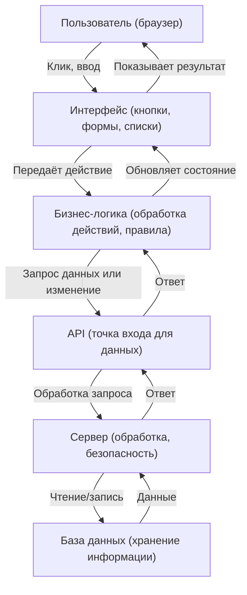
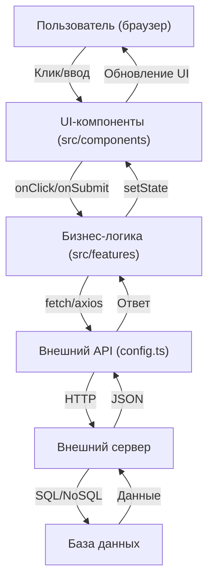
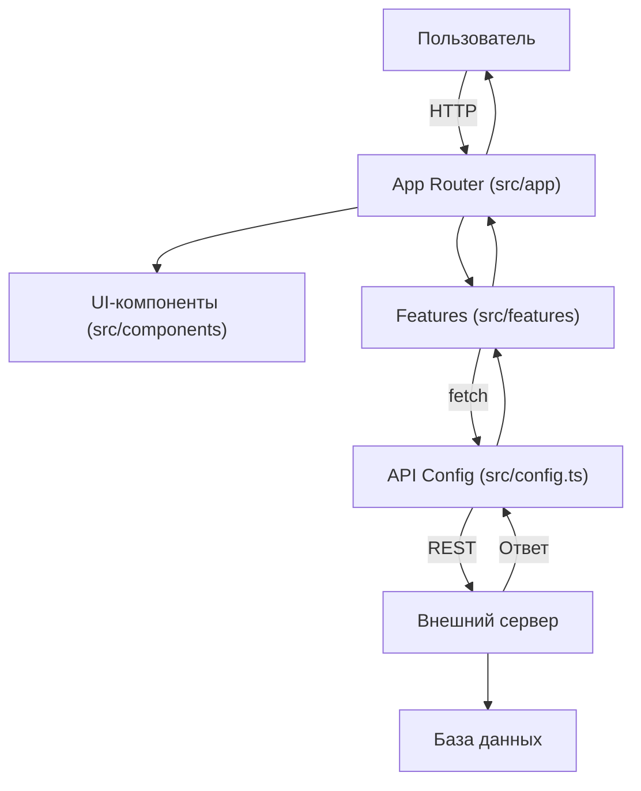
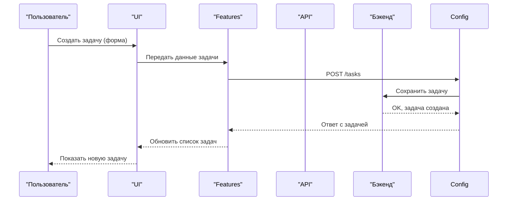
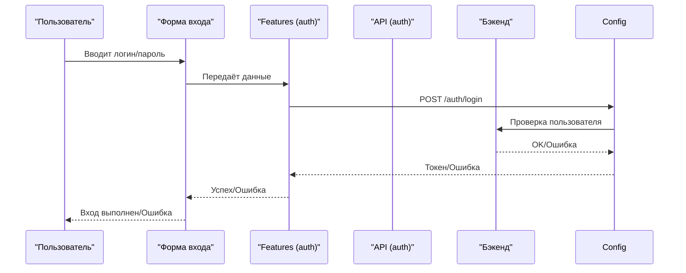
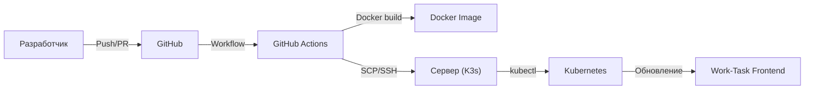

#  Work-Task Frontend

---

##  Быстрый старт

1. **Требования:**
   - **Node.js** >= 20.17.0 — это среда, в которой запускается JavaScript вне браузера. Необходима для работы всех современных фронтенд-проектов
   - **npm** >= 10.8.2 — менеджер пакетов для установки зависимостей
   - **Рекомендуется [nvm](https://github.com/nvm-sh/nvm)** — это инструмент для удобного переключения между разными версиями Node.js
   - **Проверить версии:**
     ```bash
     node -v
     npm -v
     ```
   - **Если версия ниже:**
     - **Обновить через сайт:**
       1. Перейдите на [nodejs.org](https://nodejs.org/)
       2. Скачайте и установите последнюю LTS-версию для вашей ОС
       3. Перезапустите терминал и проверьте версии снова
     - **Обновить через nvm (если установлен):**
       ```bash
       nvm install 20
       nvm use 20
       nvm alias default 20
       node -v
       npm -v
       ```
   - **Зачем это нужно:** Современные проекты используют новые возможности языка и инструментов, которые не поддерживаются старыми версиями Node.js и npm. Если не обновить — проект может не запуститься или работать с ошибками.

2. **Установка и запуск:**
   - **Склонируйте репозиторий:** скачайте проект к себе на компьютер.
     ```bash
     git clone <ссылка на репозиторий>
     ```
   - **Установите зависимости:** скачайте все нужные библиотеки для работы проекта.
     ```bash
     npm install
     ```
   - **Запустите проект в режиме разработки:**
     ```bash
     npm run dev
     ```
     После запуска откройте [http://localhost:3000](http://localhost:3000) в браузере.
     - Если порт 3000 занят, либо закройте другое приложение, либо используйте переменную окружения: `PORT=3001 npm run dev`
   - **Сборка и запуск для продакшена:**
     ```bash
     npm run build
     npm start
     ```
     Это создаст оптимизированную версию приложения и запустит её как production-сервер.
   - **Если что-то не работает:**
     - Проверьте сообщения об ошибках в терминале — они обычно подсказывают, что делать.
     - Убедитесь, что установлены правильные версии Node.js и npm.
     - Попробуйте удалить папку `node_modules` и файл `package-lock.json`, затем снова выполнить `npm install`.

---

## 🛠️ Полезные команды для фронта

- `npm run dev` — запуск проекта в режиме разработки (автоматически обновляет страницу при изменениях кода)
- `npm run build` — сборка проекта для продакшена (создаёт оптимизированную версию)
- `npm start` — запуск production-сервера (используется после сборки)
- `npm run lint` — проверка кода на стиль и ошибки (ESLint)
- `npm run format` — автоформатирование кода (например, Prettier; может не быть настроено)
- `npm run analyze` — анализ размера бандла (если настроено; помогает понять, что занимает место в сборке)
- `npm run test` — запуск тестов (если есть; для проверки работоспособности кода)
- `npm outdated` — показать устаревшие зависимости (помогает поддерживать проект в актуальном состоянии)
- `npm audit` — аудит безопасности зависимостей (ищет уязвимости)
- `npm ls` — показать дерево зависимостей (для диагностики проблем с пакетами)

> Некоторые команды могут быть не настроены по умолчанию — смотрите `package.json` для полного списка и описания.

---

## 📝 Сводка о проекте

- **Что это:** Приложение для управления задачами и проектами (таск-трекер)
- **Технологии:** Next.js 14, TypeScript, React, Tailwind CSS, React Query, Radix UI
- **Где работает:** Любой современный браузер, Node.js >= 20.17.0
- **Интеграции:**
  - Внешний REST API (бэкенд на отдельном сервере)
  - CI/CD через GitHub Actions
  - Docker/Kubernetes (K3s)
- **Структура:**
  - UI-компоненты (`src/components/`)
  - Бизнес-логика (`src/features/`)
  - Конфигурация API (`src/config.ts`)
  - Конфиги, хуки, утилиты и т.д.

---

## 🏗️ Как работает Work-Task: 

### 1. Общий поток данных и ролей

**Пояснение:**  
Показывает, как любое действие пользователя (например, клик по кнопке) проходит через все уровни приложения — от интерфейса до базы данных и обратно.



---

### 2. Как это связано с папками проекта(условно)?

| Этап | Что происходит | Где в проекте |
|------|----------------|---------------|
| Пользователь кликает/вводит | Отправляется действие (например, клик по кнопке) | `src/components/` (UI-компоненты) |
| Интерфейс вызывает бизнес-логику | Обработка действия, подготовка данных | `src/features/` (логика, обработчики) |
| Бизнес-логика вызывает внешний API | Запрос к серверу (например, получить/создать/изменить данные) | `src/config.ts` (настройки API) |
| API общается с сервером | Сервер обрабатывает запрос, проверяет права, валидирует данные | Внешний сервер (отдельный репозиторий) |
| Сервер работает с базой данных | Чтение или запись информации | Серверная часть/БД |
| Ответ возвращается обратно | Данные идут обратно по цепочке: сервер → API → бизнес-логика → интерфейс | Все те же папки, но в обратном порядке |
| Интерфейс обновляет экран | Пользователь видит результат (например, новая задача появилась в списке) | `src/components/` (UI-компоненты) |

---

### 3. Пример: что происходит, когда пользователь создаёт задачу?

1. **Пользователь** нажимает кнопку "Создать задачу" (или заполняет форму).
   - **Где в коде:** компонент кнопки/формы в `src/components/`  
2. **Интерфейс** вызывает функцию из бизнес-логики, чтобы обработать это действие.
   - **Где в коде:** обработчик события в `src/features/`
3. **Бизнес-логика** формирует запрос к внешнему API, чтобы создать задачу на сервере.
   - **Где в коде:** вызов API через `src/config.ts`
4. **API** получает запрос, передаёт его на внешний сервер.
   - **Где в коде:** внешний сервер (отдельный репозиторий)
5. **Сервер** сохраняет задачу в базе данных.
   - **Где в коде:** серверная часть (обычно не в этом репозитории)
6. **Ответ** возвращается обратно по цепочке.
   - **Где в коде:** всё те же папки, но в обратном порядке
7. **Интерфейс** обновляет список задач, пользователь видит новую задачу.
   - **Где в коде:** компонент списка задач в `src/components/`

---

### 4. Почему так устроено?

- **Разделение ответственности:**  
  Каждый слой отвечает только за свою задачу (UI — за отображение, бизнес-логика — за правила, API — за обмен с сервером).
- **Удобство поддержки:**  
  Если нужно изменить, как работает кнопка — идём в компоненты.  
  Если нужно поменять правила (например, нельзя создавать пустую задачу) — идём в бизнес-логику.  
  Если нужно изменить, как данные хранятся — идём во внешний сервер.
- **Масштабируемость:**  
  Такой подход позволяет легко добавлять новые функции, не ломая старые.

---

### 5. Диаграмма: как пользовательское действие проходит через проект



---

## 🧩 Архитектура данных и поток пользователя

> Полный цикл: пользователь → страница → компоненты → бизнес-логика → API → сервер → база данных → обратно к пользователю.



**Пояснение:**
Пользователь отправляет запрос (например, открывает страницу или создаёт задачу), данные проходят через компоненты, бизнес-логику, API, сервер и базу данных, а затем результат возвращается обратно.

---

## 🔄 Жизненный цикл задачи (Task Lifecycle)

> Как создаётся, отображается, редактируется и удаляется задача.



**Пояснение:**
Пошагово показано, как создаётся задача и как она появляется в интерфейсе пользователя.

---

## 🔐 Процесс авторизации (Auth Flow)

> Как происходит вход пользователя в систему.



**Пояснение:**
Показывает, как происходит вход пользователя, где проверяются данные и как возвращается результат.

---

## ⚙️ CI/CD Pipeline (Деплой)

> Как код из репозитория автоматически попадает на сервер и разворачивается.



**Пояснение:**
Показывает, как происходит автоматический деплой: от коммита до обновления приложения на сервере.

---

## 🗂️ Архитектура основных папок проекта

- `src/components/` — UI-компоненты: кнопки, формы, списки, модальные окна и всё, что отвечает за внешний вид и взаимодействие с пользователем.
- `src/features/` — бизнес-логика: обработка действий пользователя, правила работы приложения, интеграция с API.
- `src/config.ts` — конфигурация API: настройки для подключения к внешнему серверу, эндпоинты и утилиты для работы с API.
- `src/hooks/` — кастомные хуки React: переиспользуемые функции для работы с состоянием, эффектами и т.д.
- `src/lib/` — утилиты, вспомогательные функции и типы.
- `public/` — статические файлы: картинки, иконки, шрифты.
- `config.ts`, `package.json`, конфиги — настройки, зависимости, скрипты.

> Эти папки — основа архитектуры. Внутри них могут появляться новые файлы и подпапки, но сами разделы почти не меняются.

---

## 🛠️ Основные команды

- `npm run dev` — запуск в режиме разработки
- `npm run build` — сборка для продакшена
- `npm start` — запуск production-сервера
- `npm run lint` — проверка кода на стиль

---

## 🧩 Технологии 

- [Next.js 14](https://nextjs.org/) — современный фреймворк для сайтов
- [TypeScript](https://www.typescriptlang.org/) — помогает не ошибаться в коде
- [React Query](https://tanstack.com/query/latest) — ускоряет работу с сервером
- [Tailwind CSS](https://tailwindcss.com/docs) — красивые стили прямо в коде
- [Radix UI](https://www.radix-ui.com/docs/primitives/overview/introduction) — готовые элементы интерфейса

---

## 💡 Советы

- Читать README.md в каждой папке — там всё объяснено.
- Если что-то не работает — внимательно читайте ошибку в терминале.
- Перед коммитом всегда запускайте `npm run lint`.
- Любое изменение — это вклад в проект!

---

## ❓ FAQ (Частые вопросы и проблемы)

**Q: У меня ошибка про несовместимость Node.js или npm**  
A: Проверьте версии через `node -v` и `npm -v`. Если ниже требуемых — обновите Node.js (см. раздел "Требования").

**Q: Ошибка EADDRINUSE: порт 3000 уже используется**  
A: Закройте другое приложение, использующее этот порт, или запустите проект на другом порту: `PORT=3001 npm run dev`

**Q: Ошибка при установке зависимостей (npm install)**  
A: Попробуйте удалить папку `node_modules` и файл `package-lock.json`, затем снова выполнить `npm install`.

**Q: Ошибка 'Cannot find module ...' или 'Module not found'**  
A: Проверьте, что все зависимости установлены (`npm install`). Если не помогло — удалите `node_modules` и `package-lock.json`, затем снова установите.

**Q: Ошибка 'npm: command not found'**  
A: Убедитесь, что Node.js и npm установлены и доступны в PATH. Проверьте через `node -v` и `npm -v`.

**Q: Как обновить npm до последней версии?**  
A: Выполните `npm install -g npm@latest` (может потребоваться sudo на Linux/Mac).

**Q: Как очистить кэш npm?**  
A: Выполните `npm cache clean --force`.

**Q: Как узнать, какие зависимости устарели?**  
A: Выполните `npm outdated`.

**Q: Как проверить проект на уязвимости?**  
A: Выполните `npm audit`.

**Q: Как запустить тесты?**  
A: Если тесты настроены — используйте `npm run test`.

**Q: Где искать документацию по отдельным модулям?**  
A: В каждой основной папке есть свой README.md с деталями и примерами.

**Q: Как внести свой вклад?**  
A: Создайте ветку, внесите изменения, отправьте Pull Request.

---

**Автор:** @krutakov
