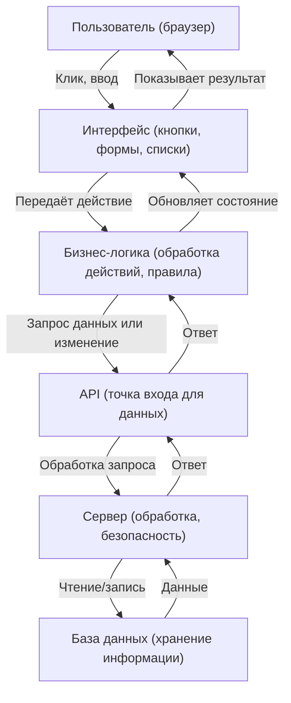
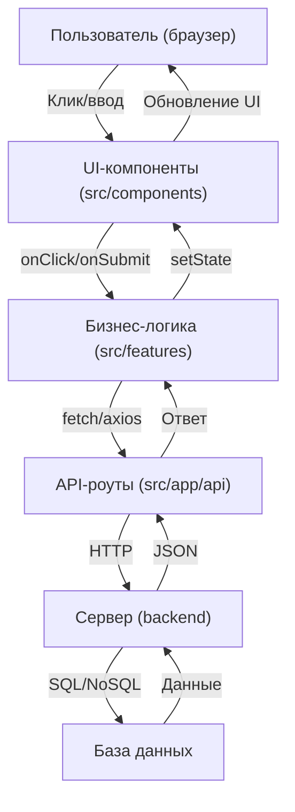
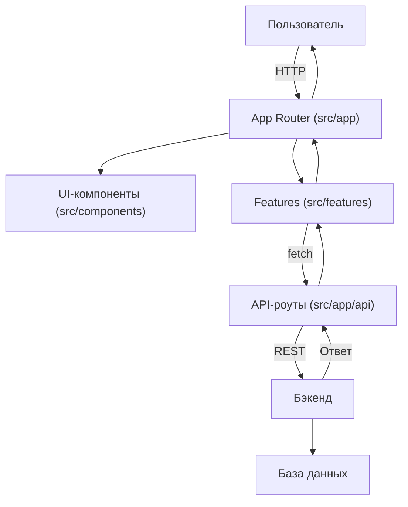
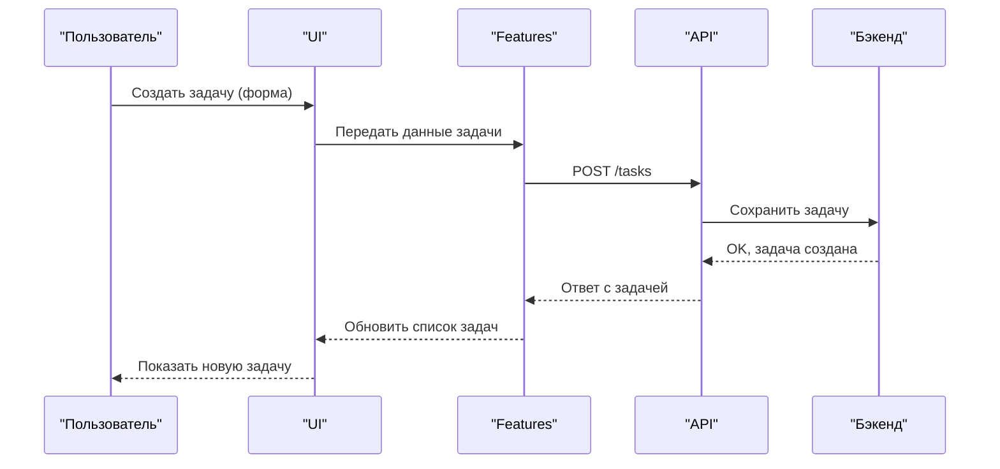
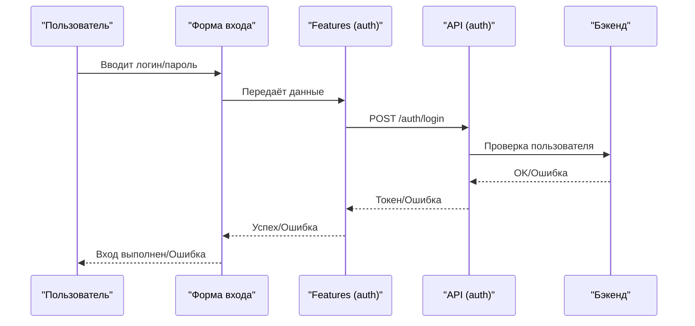
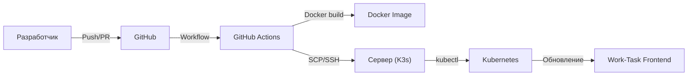

# 🚀 Work-Task Frontend

> **Добро пожаловать!**
> Это современное приложение для управления задачами и проектами. Даже если вы никогда не писали код — вы сможете разобраться и внести свой вклад!

---

## 🏗️ Как работает Work-Task: просто и понятно

### 1. Общий поток данных и ролей

**Пояснение:**  
Показывает, как любое действие пользователя (например, клик по кнопке) проходит через все уровни приложения — от интерфейса до базы данных и обратно.



---

### 2. Как это связано с папками проекта?

| Этап | Что происходит | Где в проекте |
|------|----------------|---------------|
| Пользователь кликает/вводит | Отправляется действие (например, клик по кнопке) | `src/components/` (UI-компоненты) |
| Интерфейс вызывает бизнес-логику | Обработка действия, подготовка данных | `src/features/` (логика, обработчики) |
| Бизнес-логика вызывает API | Запрос к серверу (например, получить/создать/изменить данные) | `src/app/api/` (API-роуты) |
| API общается с сервером | Сервер обрабатывает запрос, проверяет права, валидирует данные | Серверная часть (обычно отдельный репозиторий, но может быть и тут) |
| Сервер работает с базой данных | Чтение или запись информации | Серверная часть/БД |
| Ответ возвращается обратно | Данные идут обратно по цепочке: сервер → API → бизнес-логика → интерфейс | Все те же папки, но в обратном порядке |
| Интерфейс обновляет экран | Пользователь видит результат (например, новая задача появилась в списке) | `src/components/` (UI-компоненты) |

---

### 3. Пример: что происходит, когда пользователь создаёт задачу?

1. **Пользователь** нажимает кнопку "Создать задачу" (или заполняет форму).
   - **Где в коде:** компонент кнопки/формы в `src/components/`  
2. **Интерфейс** вызывает функцию из бизнес-логики, чтобы обработать это действие.
   - **Где в коде:** обработчик события в `src/features/`
3. **Бизнес-логика** формирует запрос к API, чтобы создать задачу на сервере.
   - **Где в коде:** вызов API в `src/app/api/`
4. **API** получает запрос, передаёт его на сервер.
   - **Где в коде:** обработчик API в `src/app/api/`
5. **Сервер** сохраняет задачу в базе данных.
   - **Где в коде:** серверная часть (обычно не в этом репозитории)
6. **Ответ** возвращается обратно по цепочке.
   - **Где в коде:** всё те же папки, но в обратном порядке
7. **Интерфейс** обновляет список задач, пользователь видит новую задачу.
   - **Где в коде:** компонент списка задач в `src/components/`

---

### 4. Почему так устроено?

- **Разделение ответственности:**  
  Каждый слой отвечает только за свою задачу (UI — за отображение, бизнес-логика — за правила, API — за обмен с сервером).
- **Удобство поддержки:**  
  Если нужно изменить, как работает кнопка — идём в компоненты.  
  Если нужно поменять правила (например, нельзя создавать пустую задачу) — идём в бизнес-логику.  
  Если нужно изменить, как данные хранятся — идём в API или сервер.
- **Масштабируемость:**  
  Такой подход позволяет легко добавлять новые функции, не ломая старые.

---

### 5. Диаграмма: как пользовательское действие проходит через проект



---

## 🧩 Архитектура данных и поток пользователя

> Полный цикл: пользователь → страница → компоненты → бизнес-логика → API → сервер → база данных → обратно к пользователю.



**Пояснение:**
Пользователь отправляет запрос (например, открывает страницу или создаёт задачу), данные проходят через компоненты, бизнес-логику, API, сервер и базу данных, а затем результат возвращается обратно.

---

## 🔄 Жизненный цикл задачи (Task Lifecycle)

> Как создаётся, отображается, редактируется и удаляется задача.



**Пояснение:**
Пошагово показано, как создаётся задача и как она появляется в интерфейсе пользователя.

---

## 🔐 Процесс авторизации (Auth Flow)

> Как происходит вход пользователя в систему.



**Пояснение:**
Показывает, как происходит вход пользователя, где проверяются данные и как возвращается результат.

---

## ⚙️ CI/CD Pipeline (Деплой)

> Как код из репозитория автоматически попадает на сервер и разворачивается.



**Пояснение:**
Показывает, как происходит автоматический деплой: от коммита до обновления приложения на сервере.

---

## 🗂️ Полная структура проекта (с путями до каждого файла)

```
frontend/
├── .github/
│   └── workflows/
│       └── deploy.yml
├── public/
│   └── logo.svg
├── src/
│   ├── app/
│   │   ├── (auth)/
│   │   │   ├── sign-in/
│   │   │   │   ├── page.tsx
│   │   │   │   └── README.md
│   │   │   ├── sign-up/
│   │   │   │   ├── page.tsx
│   │   │   │   └── README.md
│   │   │   ├── layout.tsx
│   │   │   └── README.md
│   │   ├── (dashboard)/
│   │   │   ├── tasks/
│   │   │   │   ├── page.tsx
│   │   │   │   └── README.md
│   │   │   ├── projects/
│   │   │   │   ├── [projectId]/
│   │   │   │   │   ├── page.tsx
│   │   │   │   │   └── README.md
│   │   │   │   ├── page.tsx
│   │   │   │   └── README.md
│   │   │   ├── settings/
│   │   │   │   ├── page.tsx
│   │   │   │   └── README.md
│   │   │   ├── page.tsx
│   │   │   ├── layout.tsx
│   │   │   └── README.md
│   │   ├── (standalone)/
│   │   │   ├── layout.tsx
│   │   │   └── README.md
│   │   ├── api/
│   │   │   ├── [[...route]]/
│   │   │   │   ├── route.ts
│   │   │   │   └── README.md
│   │   │   ├── route.ts
│   │   │   └── README.md
│   │   ├── oauth/
│   │   │   ├── route.ts
│   │   │   └── README.md
│   │   ├── fonts/
│   │   │   ├── GeistVF.woff
│   │   │   ├── GeistMonoVF.woff
│   │   │   └── README.md
│   │   ├── globals.css
│   │   ├── layout.tsx
│   │   ├── loading.tsx
│   │   ├── favicon.ico
│   │   ├── error.tsx
│   │   └── README.md
│   ├── components/
│   │   ├── ui/
│   │   │   ├── controls/
│   │   │   │   ├── avatar.tsx
│   │   │   │   ├── button.tsx
│   │   │   │   ├── calendar.tsx
│   │   │   │   ├── checkbox.tsx
│   │   │   │   └── README.md
│   │   │   ├── feedback/
│   │   │   │   ├── badge.tsx
│   │   │   │   ├── skeleton.tsx
│   │   │   │   ├── sonner.tsx
│   │   │   │   ├── visually-hidden.tsx
│   │   │   │   └── README.md
│   │   │   ├── form/
│   │   │   │   ├── form.tsx
│   │   │   │   ├── input.tsx
│   │   │   │   ├── label.tsx
│   │   │   │   ├── select.tsx
│   │   │   │   ├── textarea.tsx
│   │   │   │   └── README.md
│   │   │   ├── layout/
│   │   │   │   ├── card.tsx
│   │   │   │   ├── chart.tsx
│   │   │   │   ├── dialog.tsx
│   │   │   │   ├── drawer.tsx
│   │   │   │   ├── dropdown-menu.tsx
│   │   │   │   ├── popover.tsx
│   │   │   │   ├── scroll-area.tsx
│   │   │   │   ├── separator.tsx
│   │   │   │   ├── sheet.tsx
│   │   │   │   ├── table.tsx
│   │   │   │   ├── tabs.tsx
│   │   │   │   └── README.md
│   │   │   └── README.md
│   │   ├── navigation/
│   │   │   ├── navigation.tsx
│   │   │   ├── workspace-switcher.tsx
│   │   │   └── README.md
│   │   ├── layout/
│   │   │   ├── mobile-sidebar.tsx
│   │   │   ├── navbar.tsx
│   │   │   ├── query-provider.tsx
│   │   │   ├── sidebar.tsx
│   │   │   └── README.md
│   │   ├── feedback/
│   │   │   ├── dotted-separator.tsx
│   │   │   ├── page-error.tsx
│   │   │   ├── page-loader.tsx
│   │   │   ├── responsive-modal.tsx
│   │   │   └── README.md
│   │   ├── inputs/
│   │   │   ├── date-picker.tsx
│   │   │   └── README.md
│   │   ├── data-display/
│   │   │   ├── analytics-card.tsx
│   │   │   ├── analytics.tsx
│   │   │   ├── projects.tsx
│   │   │   └── README.md
│   │   └── README.md
│   ├── features/
│   │   ├── auth/
│   │   │   ├── api/
│   │   │   │   ├── use-current.ts
│   │   │   │   ├── use-login.ts
│   │   │   │   ├── use-logout.ts
│   │   │   │   ├── use-register.ts
│   │   │   │   └── README.md
│   │   │   ├── components/
│   │   │   │   ├── sign-in-card.tsx
│   │   │   │   ├── sign-up-card.tsx
│   │   │   │   ├── user-button.tsx
│   │   │   │   └── README.md
│   │   │   ├── constants.ts
│   │   │   ├── queries.ts
│   │   │   ├── schemas.ts
│   │   │   └── README.md
│   │   ├── projects/
│   │   │   ├── api/
│   │   │   │   ├── use-create-project.ts
│   │   │   │   ├── use-get-project.ts
│   │   │   │   ├── use-get-projects.ts
│   │   │   │   └── README.md
│   │   │   ├── components/
│   │   │   │   ├── create-project-form.tsx
│   │   │   │   ├── create-project-modal.tsx
│   │   │   │   ├── edit-project-form.tsx.disabled
│   │   │   │   ├── project-avatar.tsx
│   │   │   │   └── README.md
│   │   │   ├── hooks/
│   │   │   │   ├── use-create-project-modal.ts
│   │   │   │   ├── use-project-id.ts
│   │   │   │   └── README.md
│   │   │   ├── schemas.ts
│   │   │   ├── types.ts
│   │   │   └── README.md
│   │   ├── tasks/
│   │   │   ├── api/
│   │   │   │   ├── use-create-task.ts
│   │   │   │   ├── use-get-tasks.ts
│   │   │   │   ├── use-update-task.ts
│   │   │   │   └── README.md
│   │   │   ├── components/
│   │   │   │   ├── calendar/
│   │   │   │   ├── filters/
│   │   │   │   ├── forms/
│   │   │   │   ├── kanban/
│   │   │   │   ├── table/
│   │   │   │   ├── create-task-form-wrapper.tsx
│   │   │   │   ├── create-task-form.tsx
│   │   │   │   ├── create-task-modal.tsx
│   │   │   │   └── README.md
│   │   │   ├── hooks/
│   │   │   │   ├── use-create-task-modal.ts
│   │   │   │   ├── use-edit-task-modal.ts
│   │   │   │   ├── use-task-filters.ts
│   │   │   │   ├── use-task-id.ts
│   │   │   │   └── README.md
│   │   │   ├── schemas.ts
│   │   │   ├── types.ts
│   │   │   └── README.md
│   ├── lib/
│   │   ├── rpc.ts
│   │   ├── utils.ts
│   │   ├── types.ts
│   │   └── README.md
│   ├── hooks/
│   │   ├── use-confirm.tsx
│   │   └── README.md
│   ├── config.ts
├── tailwind.config.ts
├── next.config.mjs
├── postcss.config.mjs
├── package.json
├── package-lock.json
├── Dockerfile
├── nginx.conf
├── components.json
├── README.md
└── tsconfig.json
```

> В каждой папке есть свой README.md с примерами и объяснениями.

---

## 🛠️ Основные команды

- `npm run dev` — запуск в режиме разработки
- `npm run build` — сборка для продакшена
- `npm start` — запуск production-сервера
- `npm run lint` — проверка кода на стиль

---

## 🧩 Технологии (не бойтесь, всё просто!)

- [Next.js 14](https://nextjs.org/) — современный фреймворк для сайтов
- [TypeScript](https://www.typescriptlang.org/) — помогает не ошибаться в коде
- [React Query](https://tanstack.com/query/latest) — ускоряет работу с сервером
- [Tailwind CSS](https://tailwindcss.com/docs) — красивые стили прямо в коде
- [Radix UI](https://www.radix-ui.com/docs/primitives/overview/introduction) — готовые элементы интерфейса

---

## 💡 Советы новичкам

- Не стесняйтесь читать README.md в каждой папке — там всё объяснено!
- Если что-то не работает — внимательно читайте ошибку в терминале.
- Не бойтесь спрашивать или искать ответы в Google.
- Перед коммитом всегда запускайте `npm run lint`.
- Любое изменение — это вклад в проект!

---

## ❓ FAQ (Частые вопросы)

**Q: У меня ошибка про Node.js или npm?**  
A: Проверьте версии через `node -v` и `npm -v`. Используйте Node.js >= 20.17.0 и npm >= 10.8.2.

**Q: Как запустить проект?**  
A: Просто выполните шаги из раздела "Как начать" выше.

**Q: Где искать документацию по отдельным модулям?**  
A: В каждой папке есть свой README.md с примерами.

**Q: Как внести свой вклад?**  
A: Создайте ветку, внесите изменения, отправьте Pull Request.

---

**Автор:** @krutakov
