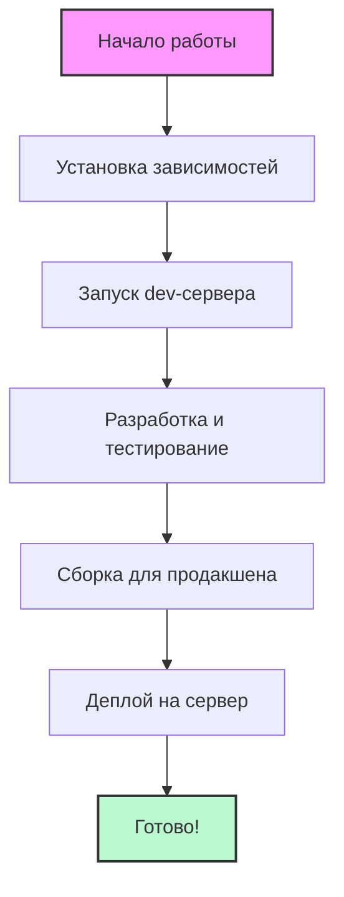
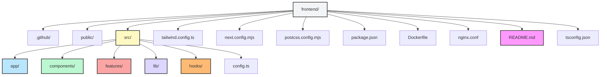

# 🚀 Work-Task Frontend

---

## 🏁 Что это такое?
Work-Task — это веб-приложение для управления задачами и проектами.

---

## 📦 Структура проекта





---

## 🧑‍💻 Как начать 

1. **Установите Node.js** (версия >= 20.17.0) и npm (>= 10.8.2). Лучше всего через [nvm](https://github.com/nvm-sh/nvm).
2. Скачайте проект:
   ```bash
   git clone <ссылка на репозиторий>
   cd frontend
   ```
3. Установите зависимости:
   ```bash
   npm install
   ```
4. Запустите проект в режиме разработки:
   ```bash
   npm run dev
   ```
5. Откройте [http://localhost:3000](http://localhost:3000) в браузере.
6. Для продакшена:
   ```bash
   npm run build
   npm start
   ```

---

## 🗂️ Описание структуры

- **.github/** — автоматизация (CI/CD), хранит сценарии для деплоя.
- **public/** — картинки, иконки, логотипы.
- **src/app/** — страницы, роутинг, layout, обработка ошибок, стили.
- **src/components/** — переиспользуемые кусочки интерфейса (кнопки, формы, меню и т.д.).
- **src/features/** — бизнес-логика по разделам: авторизация, проекты, задачи.
- **src/lib/** — вспомогательные функции, типы, утилиты.
- **src/hooks/** — кастомные хуки для React.
- **config.ts** — глобальные настройки.
- **Dockerfile, nginx.conf** — для деплоя в Docker/Kubernetes.
- **package.json** — список зависимостей и команд.
- **README.md** — этот файл!

> В каждой основной папке есть свой README.md с подробностями и примерами.

---

## 🛠️ Основные команды

- `npm run dev` — запуск в режиме разработки
- `npm run build` — сборка для продакшена
- `npm start` — запуск production-сервера
- `npm run lint` — проверка кода на стиль

---

## 🧩 Технологии

- [Next.js 14](https://nextjs.org/) — современный React-фреймворк
- [TypeScript](https://www.typescriptlang.org/) — строгая типизация
- [React Query](https://tanstack.com/query/latest) — кэширование и работа с API
- [Tailwind CSS](https://tailwindcss.com/docs) — стилизация
- [Radix UI](https://www.radix-ui.com/docs/primitives/overview/introduction) — UI-примитивы

---

## 💡 Советы и лучшие практики

- README.md в каждой папке — для упрощения понимания структуры проекта.
- Не храните бизнес-логику в UI-компонентах.
- Для новых API — добавляйте хуки в `features/*/api/`.
- Перед коммитом всегда запускайте `npm run lint`.
- Если что-то не работает — ищите ошибку в терминале, она обычно подсказывает решение.

---

## ❓ FAQ (Частые вопросы)

**Q: Ошибка про Node.js или npm**
A: Проверить версии через `node -v` и `npm -v`. Использовать Node.js >= 20.17.0 и npm >= 10.8.2. Лучше всего — через nvm.

**Q: Не запускается workflow GitHub Actions, пишет про секреты?**
A: Добавьте секреты `SERVER_IP`, `SERVER_USER`, `SSH_PRIVATE_KEY` в Settings → Secrets and variables → Actions.

**Q: Не запускается production-сервер (ошибка .next)?**
A: Выполните `npm run build` перед `npm start`.

**Q: Где искать документацию по отдельным модулям?**
A: В каждой основной папке есть свой README.md с деталями и примерами.

---

**Автор:** @krutakov
